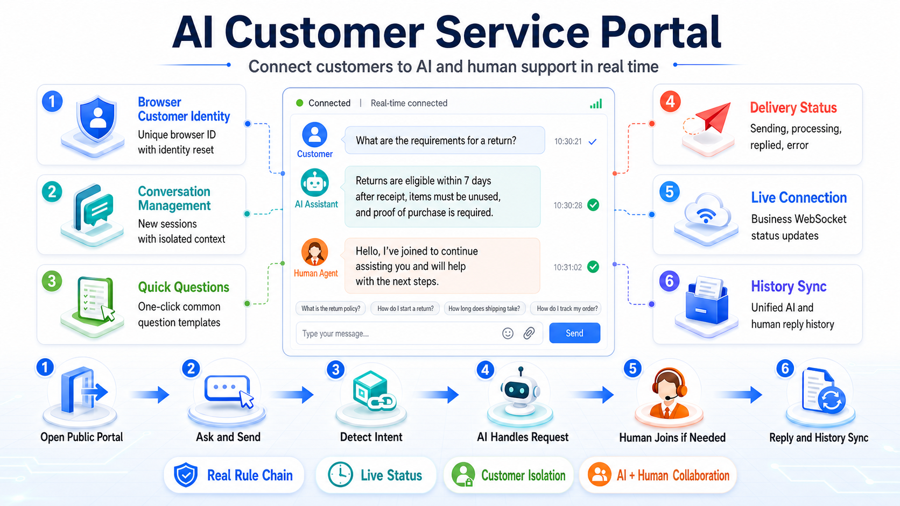
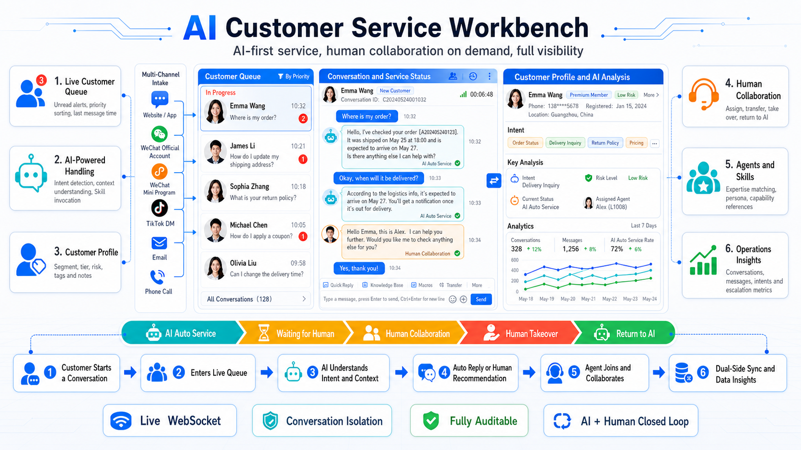

# Complete RuleGo AI Customer Service Demo

English | [简体中文](README.md)

This repository is a complete AI customer-service scenario that runs as standalone frontend pages and connects to a real RuleGo backend. It keeps two full HTML applications and one full rule chain: the customer portal provides the public conversation entry point, the service workbench manages queues, AI automation, human collaboration, agents, and audits, and the rule chain handles isolation, context, intent detection, Skill routing, model calls, human intervention, and reporting.

The repository does not include a RuleGo Server binary, embed a test backend, or turn failed requests into fake success responses. Business data, replies, history, and processing states shown by the pages come from the configured RuleGo service.

## Screenshots

### Customer portal


### Service workbench


## Functional Architecture

### Customer portal



### Service workbench



### End-to-end customer-service flow


## Repository Contents

```text
.
├── customer-client.html
├── customer-service.html
├── rulechains/
│   └── ai_customer_service_backend_v1.template.json
├── assets/
│   ├── screenshots/
│   └── architecture/
├── serve.py
├── README.md
├── README.en.md
└── LICENSE
```

- `customer-client.html`: public customer-facing conversation portal.
- `customer-service.html`: service-agent and operations workbench.
- `rulechains/ai_customer_service_backend_v1.template.json`: complete rule-chain template with 58 nodes, 107 connections, and two Endpoints.
- `serve.py`: dependency-free static server; it never proxies or simulates backend APIs.
- `assets/screenshots/`: actual running screenshots of both full pages.
- `assets/architecture/`: Chinese and English architecture diagrams for the portal, workbench, RuleGo core, server, and editor, plus the ImageGen prompts.

## Main Capabilities

### Customer portal

- Creates a browser-scoped customer identity with identity reset and new-session controls.
- Isolates context by `tenantId + channel + userId + sessionId`.
- Shows sending, processing, AI reply, human reply, and error states.
- Supports quick questions, history synchronization, deduplication, and live status.
- Connects to a real business WebSocket and preserves actionable errors when it fails.
- Keeps customer configuration focused on the server URL and rule-chain ID.

### Service workbench

- Accepts a Bearer Token or exchanges a username and password through `/login`.
- Provides a searchable, paginated customer queue with unread and recency signals.
- Manages notes, profiles, business context, validation criteria, and conversation history.
- Supports AI auto service, waiting for a human, collaboration, takeover, and return to AI.
- Manages agent status, specialties, responsibilities, persona, and Skill references.
- Exposes business scenarios, response reports, raw JSON, intents, Skills, and call-chain audits.
- Keeps the business WebSocket separate from the RuleGo debug-log WebSocket.

### Rule chain

The chain ID is `ai_customer_service_backend_v1`. It provides these operations:

| Operation | Purpose |
| --- | --- |
| `CUSTOMER_MESSAGE` | Process a customer message, detect intent, call Skills and the model, and persist context |
| `CUSTOMER_LIST` | Query the customer and session index |
| `CONVERSATION_HISTORY` | Load history for one isolated conversation |
| `SCHEDULE_MAINTAIN` | Maintain customer indexes and session summaries |
| `QUICK_INPUTS` | Return real scenario and quick-question definitions |
| `RESPONSE_REPORT` | Aggregate conversation, intent, response, and human-service metrics |
| `CUSTOMER_PROFILE_UPSERT` | Update customer profile, notes, and business context |
| `HUMAN_INTERVENTION` | Assign, transfer, take over, reply, or return a session to AI |
| `AGENT_LIST` | List service-agent profiles |
| `AGENT_UPSERT` | Create or update an agent profile and Skill references |

The rule chain also includes:

- Deterministic intent pre-routing with AI intent fallback.
- Order, after-sales, technical support, FAQ, general service, and human-attention branches.
- OpenAI-compatible `/chat/completions` model invocation.
- Session, profile, customer-index, human-intervention, and agent-profile caches.
- A business WebSocket Endpoint at `:6334/api/v1/customer-service/ws`.
- A scheduled Endpoint that maintains customer sessions every five minutes.

## Quick Start

### 1. Start the static pages

Python 3.9 or newer is sufficient; no third-party package is required:

```bash
python3 serve.py
```

Default URLs:

- Customer portal: `http://127.0.0.1:5210/customer-client.html`
- Service workbench: `http://127.0.0.1:5210/customer-service.html`

Use another address or port when needed:

```bash
python3 serve.py --host 0.0.0.0 --port 8080
```

The Python standard-library server works as an alternative:

```bash
python3 -m http.server 5210
```

The static server is not a RuleGo backend. It only serves HTML and images. Every `/api/v1` business request is still handled by the RuleGo Server configured in the pages.

### 2. Prepare RuleGo Server

1. Start a RuleGo Server build that supports the node types used by this chain.
2. Verify the REST API, for example `http://localhost:19806/api/v1`.
3. If authentication is enabled, prepare a workbench account or an authorized Bearer Token.
4. Allow the static-page Origin in the backend CORS policy.
5. Use HTTPS and WSS for a public deployment.

### 3. Import and start the rule chain

Import this file in the rule-chain editor:

```text
rulechains/ai_customer_service_backend_v1.template.json
```

Then:

1. Confirm the chain ID is `ai_customer_service_backend_v1`.
2. Check for missing components or Endpoint capabilities.
3. Save the rule chain.
4. Start the rule chain.
5. Verify `CUSTOMER_LIST` or `CONVERSATION_HISTORY`.
6. Make sure port `6334` is available for the business WebSocket or expose it through a reverse proxy.

A typical save request is:

```http
POST /api/v1/rules/ai_customer_service_backend_v1
Content-Type: application/json
Authorization: Bearer <token>
```

The rule-chain execution endpoint is:

```http
POST /api/v1/rules/ai_customer_service_backend_v1/execute/CUSTOMER_MESSAGE
Content-Type: application/json
Authorization: Bearer <token>
```

Minimal message payload:

```json
{
  "operation": "CUSTOMER_MESSAGE",
  "tenantId": "default",
  "channel": "web",
  "userId": "customer_001",
  "sessionId": "session_001",
  "text": "What conditions must be met for a return?"
}
```

### 4. Configure the model

The rule chain reads these global variables:

| Variable | Example | Meaning |
| --- | --- | --- |
| `llm_url` | `https://llm.example.com/v1` | OpenAI-compatible API base URL |
| `llm_api_key` | provided by the deployer | API key; never commit it to Git |
| `llm_model` | `your-model` | model ID supported by the backend |

The template references them as:

```text
${global.llm_url}
${global.llm_api_key}
${global.llm_model}
```

The workbench can also submit a model URL, model, and key for the current browser session. The key is kept in `sessionStorage`. For production, prefer server-side global variables, a secret manager, or host-side injection. Never hard-code credentials in either HTML file or the rule-chain JSON.

### 5. Configure both pages

In the service workbench, configure:

1. `Server URL`, such as `http://localhost:19806`.
2. `Rule-chain ID`, defaulting to `ai_customer_service_backend_v1`.
3. A Bearer Token, or username and password.
4. Optional model overrides and Skill hints.
5. The business WebSocket URL.

In the customer portal, open `Service` in the top bar and configure:

1. The RuleGo Server URL.
2. The rule-chain ID.

The customer page accepts `serverUrl`, `apiBase`, `chainId`, `token`, or `accessToken` from a host through query parameters. Do not keep an administrator Token in a public URL. Use a short-lived, least-privilege customer credential or put an API gateway/BFF in front of RuleGo.

## WebSocket Channels

This scenario uses two distinct WebSocket channels:

| Channel | Default | Purpose |
| --- | --- | --- |
| Customer-service business WS | `ws://<host>:6334/api/v1/customer-service/ws` | Customer messages, AI status, AI replies, human replies, and queue updates |
| RuleGo debug-log WS | Defined by the RuleGo Server logging API | Node logs, debug events, and execution traces |

`/logs/ws` is not a replacement for the business WebSocket. A production deployment normally exposes port `6334` through a same-origin WSS reverse proxy and keeps Token or gateway authentication enabled.

## Data and Persistence

The template uses RuleGo `cacheGet` and `cacheSet` nodes for these key spaces:

```text
cs:index:{tenantId}:{channel}
cs:session:{isolationKey}
cs:profile:{isolationKey}
cs:handoff:{isolationKey}:{interventionId}
cs:agents:{tenantId}
```

Persistence depends on the Cache or Store configured in the RuleGo deployment. The template does not create SQLite tables and does not guarantee that data survives a process restart. Production deployments should use a persistent, backup-capable Store or write conversations, customers, and agent records to a business database. SQLite, PostgreSQL, Redis, and other drivers are valid as long as they preserve the `tenantId + channel + userId + sessionId` isolation contract.

## Security and Production Checklist

- The repository contains no real password, Token, API key, customer record, or external service address.
- Never send a RuleGo administrator Token to the public customer page.
- Use least-privilege, short-lived customer credentials, gateway rate limits, and Origin checks.
- Use HTTPS/WSS and an explicit CORS allowlist in production.
- Keep audit records, but do not write model keys, Tokens, or unredacted sensitive conversations to ordinary logs.
- Add timeouts, bounded retries, idempotency keys, and visible errors to order, refund, and ticket integrations.
- Disable unnecessary node `debugMode` settings and configure log retention before production release.

## Troubleshooting

### The pages open, but all API requests fail

Check the server URL, `/api/v1` path, CORS policy, authentication state, and whether the rule chain is running. The HTTP status in browser developer tools is the strongest signal for backend failures.

### `chainId not found`

The template is not imported into the current user workspace, or the page uses a different chain ID. Import, save, and start the template, then retry.

### Business realtime never connects

Verify that the Endpoint is loaded, port `6334` is available, the reverse proxy supports WebSocket Upgrade, and the URL is not the debug `/logs/ws` route.

### AI returns a fallback response

Verify `llm_url`, `llm_api_key`, and `llm_model`, and confirm the model supports OpenAI-compatible `/chat/completions` and JSON-object responses. The frontend should not invent model parameters that were not selected.

### Customer history disappears after restart

The active Cache/Store is not persistent. Configure a persistent RuleGo Store or write customer-service data to a separate business database.

## Architecture Gallery

Chinese editions:

- [Customer portal](assets/architecture/ai-customer-client-functional-architecture.png)
- [Service workbench](assets/architecture/ai-customer-workbench-functional-architecture.png)
- [RuleGo core engine](assets/architecture/rulego-core-functional-architecture.png)
- [RuleGo Server](assets/architecture/rulego-server-functional-architecture.png)
- [RuleGo editor](assets/architecture/rulego-editor-functional-architecture.png)

English editions:

- [Customer Service Portal](assets/architecture/ai-customer-client-functional-architecture-en.png)
- [Customer Service Workbench](assets/architecture/ai-customer-workbench-functional-architecture-en.png)
- [RuleGo Core Engine](assets/architecture/rulego-core-functional-architecture-en.png)
- [RuleGo Server Backend](assets/architecture/rulego-server-functional-architecture-en.png)
- [RuleGo Visual Editor](assets/architecture/rulego-editor-functional-architecture-en.png)

The source prompts are preserved in [Chinese prompts](assets/architecture/IMAGEGEN_PROMPTS.md) and [English prompts](assets/architecture/IMAGEGEN_PROMPTS.en.md).

## License

Apache License 2.0. See [LICENSE](LICENSE).

