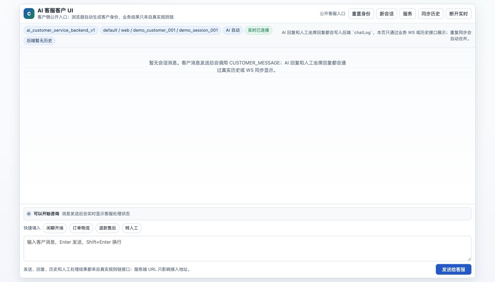
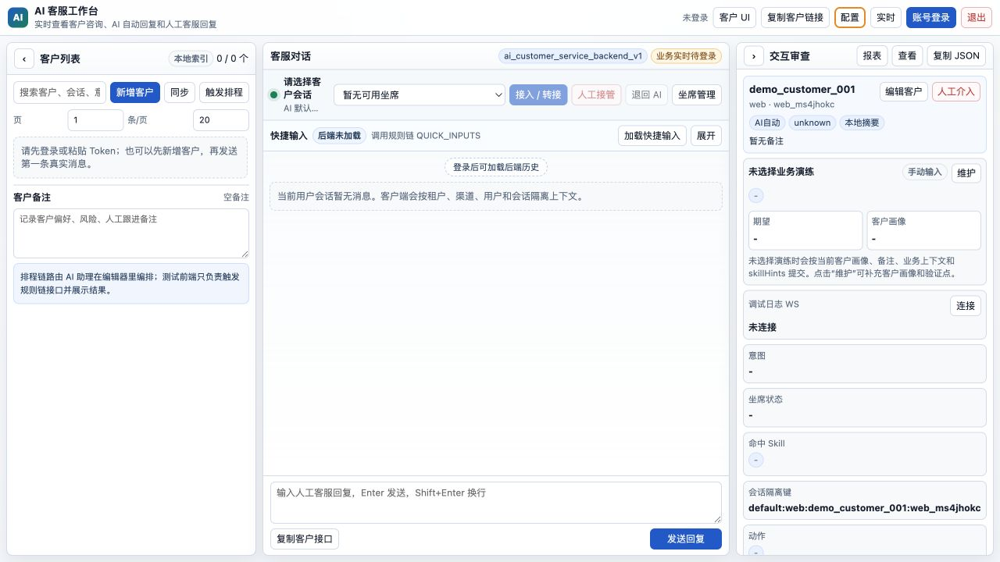
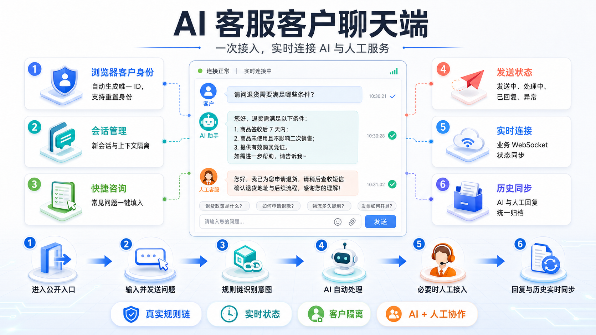
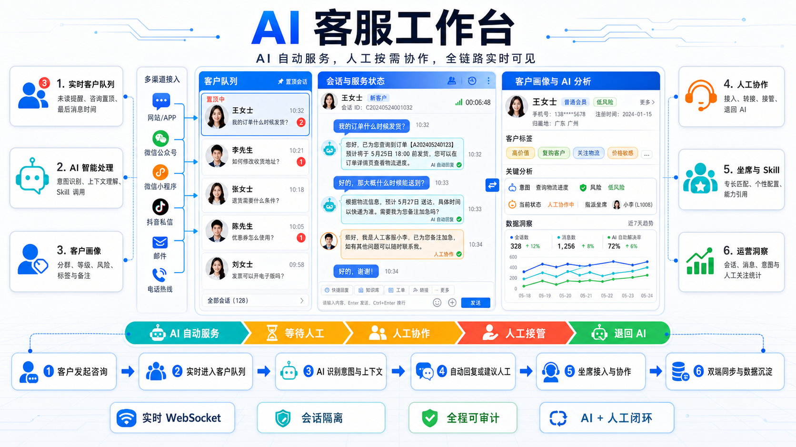

# RuleGo AI 智能客服完整演示

[English](README.en.md) | 简体中文

这是一个可独立运行前端页面、并接入真实 RuleGo 后端的 AI 智能客服场景包。仓库保留两个完整 HTML 页面和一条完整规则链：客户聊天端负责公开咨询入口，客服工作台负责客户队列、AI 自动服务、人工协作、坐席与审查；规则链负责会话隔离、上下文、意图识别、Skill 路由、模型调用、人工处理和统计。

本仓库不包含 RuleGo Server 二进制、不内置测试后端，也不会在接口失败时伪造成功结果。页面中的业务数据、回复、历史和状态都来自配置的真实 RuleGo 服务。

## 页面截图

### 客户聊天端



### 客服工作台



## 功能结构

### 客户聊天端



### 客服工作台



### 客服全链路


## 包含内容

```text
.
├── customer-client.html
├── customer-service.html
├── rulechains/
│   └── ai_customer_service_backend_v1.template.json
├── assets/
│   ├── screenshots/
│   └── architecture/
├── serve.py
├── README.md
├── README.en.md
└── LICENSE
```

- `customer-client.html`：面向客户的公开聊天入口。
- `customer-service.html`：面向客服人员和运营人员的工作台。
- `rulechains/ai_customer_service_backend_v1.template.json`：完整规则链模板，包含 58 个节点、107 条连线和 2 个 Endpoint。
- `serve.py`：零依赖静态文件服务，只负责打开页面，不代理或模拟后端。
- `assets/screenshots/`：两个完整页面的实际运行截图。
- `assets/architecture/`：客户侧、工作台、RuleGo 核心、服务端和编辑器的中英文结构图，以及 ImageGen 提示词。

## 主要能力

### 客户聊天端

- 根据浏览器生成独立客户 ID，并支持重置身份和新建会话。
- 通过 `tenantId + channel + userId + sessionId` 隔离客户上下文。
- 展示发送中、规则链处理中、AI 回复、人工回复和异常状态。
- 支持常见问题快捷填入、历史同步、消息去重和实时状态。
- 支持真实业务 WebSocket；连接失败时保留明确错误反馈。
- 客户只需要配置服务端 URL 和规则链 ID，其余身份字段自动派生。

### 客服工作台

- 支持 Bearer Token，或使用用户名和密码调用后端 `/login` 换取 Token。
- 客户列表、搜索、分页、未读提示、最近咨询排序和会话切换。
- 客户备注、画像、业务上下文、验证点和会话历史维护。
- AI 自动服务、等待人工、人工协作、人工接管和退回 AI。
- 坐席档案、状态、专长、职责、服务个性和 Skill 引用。
- 快捷业务演练、响应报表、原始 JSON、意图、Skill 与调用链审查。
- 业务 WebSocket 和调试日志 WebSocket 分开管理，避免混用。

### 规则链

规则链 ID 为 `ai_customer_service_backend_v1`，提供以下操作：

| Operation | 用途 |
| --- | --- |
| `CUSTOMER_MESSAGE` | 处理客户消息、识别意图、调用 Skill 与模型并写回上下文 |
| `CUSTOMER_LIST` | 查询客户与会话索引 |
| `CONVERSATION_HISTORY` | 查询指定客户会话历史 |
| `SCHEDULE_MAINTAIN` | 维护客户索引与会话摘要 |
| `QUICK_INPUTS` | 返回真实业务演练和快捷输入定义 |
| `RESPONSE_REPORT` | 汇总会话、意图、回复和人工处理指标 |
| `CUSTOMER_PROFILE_UPSERT` | 更新客户画像、备注和业务上下文 |
| `HUMAN_INTERVENTION` | 接入、转接、接管、人工回复或退回 AI |
| `AGENT_LIST` | 查询客服坐席档案 |
| `AGENT_UPSERT` | 新增或更新客服坐席档案与 Skill 引用 |

规则链还包含：

- 确定性意图预判和 AI 意图识别兜底。
- 订单、售后、技术支持、FAQ、通用咨询和人工关注分支。
- OpenAI 兼容 `/chat/completions` 模型调用。
- 会话、客户画像、客户索引、人工记录和坐席档案缓存。
- `:6334/api/v1/customer-service/ws` 业务 WebSocket Endpoint。
- 每 5 分钟执行一次的客户会话维护排程 Endpoint。

## 快速开始

### 1. 启动静态页面

要求 Python 3.9 或更高版本，不需要安装第三方依赖：

```bash
python3 serve.py
```

默认地址：

- 客户聊天端：`http://127.0.0.1:5210/customer-client.html`
- 客服工作台：`http://127.0.0.1:5210/customer-service.html`

可自定义监听地址和端口：

```bash
python3 serve.py --host 0.0.0.0 --port 8080
```

也可以直接使用 Python 标准库：

```bash
python3 -m http.server 5210
```

不要把静态页面服务误认为 RuleGo 后端。它只提供 HTML 和图片，所有 `/api/v1` 请求仍由页面中配置的 RuleGo Server 处理。

### 2. 准备 RuleGo Server

1. 启动支持本规则链节点类型的 RuleGo Server。
2. 确认 REST API 可访问，例如 `http://localhost:19806/api/v1`。
3. 如果启用了认证，准备工作台账号密码或有权限的 Bearer Token。
4. 配置 CORS，允许静态页面所在 Origin 访问后端。
5. 对公网客户入口使用 HTTPS，并为业务 WebSocket 使用 WSS。

### 3. 导入并启动规则链

在规则链编辑器中导入：

```text
rulechains/ai_customer_service_backend_v1.template.json
```

导入后按以下顺序操作：

1. 检查规则链 ID 是否为 `ai_customer_service_backend_v1`。
2. 检查缺失组件和 Endpoint 能力。
3. 保存规则链。
4. 启动规则链。
5. 验证 `CUSTOMER_LIST` 或 `CONVERSATION_HISTORY` 操作。
6. 确认业务 WebSocket 的 `:6334` 端口未被占用，并按部署环境开放或反向代理。

后端保存接口的典型形式为：

```http
POST /api/v1/rules/ai_customer_service_backend_v1
Content-Type: application/json
Authorization: Bearer <token>
```

规则链执行接口：

```http
POST /api/v1/rules/ai_customer_service_backend_v1/execute/CUSTOMER_MESSAGE
Content-Type: application/json
Authorization: Bearer <token>
```

最小消息示例：

```json
{
  "operation": "CUSTOMER_MESSAGE",
  "tenantId": "default",
  "channel": "web",
  "userId": "customer_001",
  "sessionId": "session_001",
  "text": "请问退货需要满足哪些条件？"
}
```

### 4. 配置模型

规则链使用以下全局变量：

| 变量 | 示例 | 说明 |
| --- | --- | --- |
| `llm_url` | `https://llm.example.com/v1` | OpenAI 兼容 API 基础地址 |
| `llm_api_key` | 由部署方提供 | API 密钥，不应提交到 Git |
| `llm_model` | `your-model` | 后端实际支持的模型 ID |

模板中的引用为：

```text
${global.llm_url}
${global.llm_api_key}
${global.llm_model}
```

工作台配置区也可以按当前浏览器会话提交模型地址、模型和密钥。密钥仅保存在 `sessionStorage`，页面刷新或会话结束后按浏览器策略清理。生产环境优先由服务端全局变量、密钥管理系统或宿主应用注入，不要把密钥硬编码进 HTML 或规则链 JSON。

### 5. 配置两个页面

客服工作台中配置：

1. `服务端 URL`，例如 `http://localhost:19806`。
2. `规则链 ID`，默认 `ai_customer_service_backend_v1`。
3. Bearer Token，或用户名和密码。
4. 可选的模型覆盖和 Skill 提示。
5. 业务 WebSocket 地址。

客户聊天端点击顶部“服务”后配置：

1. RuleGo 服务端 URL。
2. 规则链 ID。

客户页面可接受宿主通过查询参数提供 `serverUrl`、`apiBase`、`chainId`、`token` 或 `accessToken`。公网使用时不要在 URL 中长期携带管理员 Token；应使用短期、最小权限的客户访问凭证，或由 API Gateway/BFF 完成鉴权和转发。

## WebSocket 说明

本场景包含两类不同的 WebSocket：

| 通道 | 默认地址 | 用途 |
| --- | --- | --- |
| 客服业务 WS | `ws://<host>:6334/api/v1/customer-service/ws` | 客户消息、AI 状态、AI 回复、人工回复和客户列表更新 |
| RuleGo 调试日志 WS | 由 RuleGo Server 日志接口决定 | 节点日志、规则链调试事件和执行追踪 |

`/logs/ws` 不能替代客服业务 WS。生产部署通常应把 `:6334` 通过同域反向代理暴露为 WSS，并保持 Token 或网关鉴权。

## 数据与持久化

模板使用 RuleGo `cacheGet` / `cacheSet` 节点保存以下键空间：

```text
cs:index:{tenantId}:{channel}
cs:session:{isolationKey}
cs:profile:{isolationKey}
cs:handoff:{isolationKey}:{interventionId}
cs:agents:{tenantId}
```

是否持久化取决于 RuleGo 部署使用的缓存或 Store 实现。模板本身不会创建 SQLite 表，也不保证进程重启后数据仍然存在。生产使用时应配置可持久化、可备份的 Store，或把会话、客户和坐席数据写入业务数据库。无论使用 SQLite、PostgreSQL、Redis 或其他驱动，都必须保留 `tenantId + channel + userId + sessionId` 的隔离语义。

## 安全与生产检查

- 仓库不包含真实密码、Token、API Key、客户数据或外部服务地址。
- 不要向客户页面下发 RuleGo 管理员 Token。
- 为客户接口配置最小权限、短期 Token、网关限流和来源校验。
- 使用 HTTPS/WSS，配置明确的 CORS Origin，不要在生产环境允许任意来源。
- 在服务端记录审计信息，但不要把模型密钥、Token 或完整敏感对话写入普通日志。
- 对订单、退款、工单等业务接口设置超时、重试上限、幂等键和错误反馈。
- 发布前关闭不必要的节点 `debugMode`，并配置日志保留与数据脱敏策略。

## 常见问题

### 页面能打开，但接口全部失败

检查服务端 URL、`/api/v1` 路径、CORS、认证状态和规则链是否已启动。浏览器开发者工具中的 HTTP 状态码比页面文案更适合定位后端问题。

### 返回 `chainId not found`

规则链没有导入到当前用户空间，或页面配置的规则链 ID 与 JSON 中的 ID 不一致。导入、保存并启动模板后重试。

### 业务实时状态一直未连接

确认规则链 Endpoint 已加载、`:6334` 未被占用、反向代理支持 WebSocket Upgrade，并且地址不是调试日志 `/logs/ws`。

### AI 返回降级回复

检查 `llm_url`、`llm_api_key`、`llm_model`，以及模型是否支持 OpenAI 兼容的 `/chat/completions` 与 JSON 对象响应。模型参数未配置时不应由前端强行补默认值。

### 重启后客户历史消失

当前 Cache/Store 不是持久化实现。为 RuleGo 配置持久化 Store，或把会话与客户数据写入独立业务数据库。

## 架构图库

中文：

- [客户聊天端](assets/architecture/ai-customer-client-functional-architecture.png)
- [客服工作台](assets/architecture/ai-customer-workbench-functional-architecture.png)
- [RuleGo 核心引擎](assets/architecture/rulego-core-functional-architecture.png)
- [RuleGo Server](assets/architecture/rulego-server-functional-architecture.png)
- [RuleGo 编辑器](assets/architecture/rulego-editor-functional-architecture.png)

English:

- [Customer Service Portal](assets/architecture/ai-customer-client-functional-architecture-en.png)
- [Customer Service Workbench](assets/architecture/ai-customer-workbench-functional-architecture-en.png)
- [RuleGo Core Engine](assets/architecture/rulego-core-functional-architecture-en.png)
- [RuleGo Server Backend](assets/architecture/rulego-server-functional-architecture-en.png)
- [RuleGo Visual Editor](assets/architecture/rulego-editor-functional-architecture-en.png)

生成提示词保存在 [中文提示词](assets/architecture/IMAGEGEN_PROMPTS.md) 和 [English prompts](assets/architecture/IMAGEGEN_PROMPTS.en.md)。

## License

Apache License 2.0，见 [LICENSE](LICENSE)。

